# Mask_Detection
This is a DeepLearning project which will detect whether a person present in given image wore mask or not.

## Dataset
Datset used in this Project consists of two folders (`yes`,`no`). Yes folder consists of `1188` `jpg images` of person wearning mask. No folder consists of `1200` `jpg images` of person not wearing mask. 
Dataset can be downloaded from the link given in ***dataset.txt*** file.

## Code
- The images downloaded are preprocessed and converted to batches (size:32) dataset. Data Augumentation is also applied as the available data is less for the Deep Learning model.
- Best parameters(Dropout,optimizer) are selected using Tensorboard visualization.(To know more about Tensorboard visit [TensorBoard](https://www.tensorflow.org/tensorboard). 
- Project is done in python using Tensorflow ML library (To know more about TensorFlow visit [TensorFlow](https://www.tensorflow.org/). 

## Visualization
### Train data visualization using Tensorboard
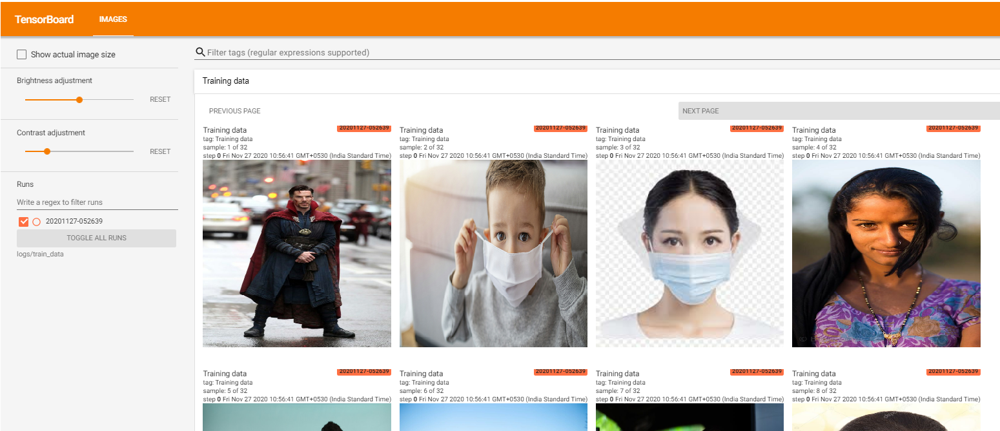
### Example of Epoch run with the help of Tensorboard hparams
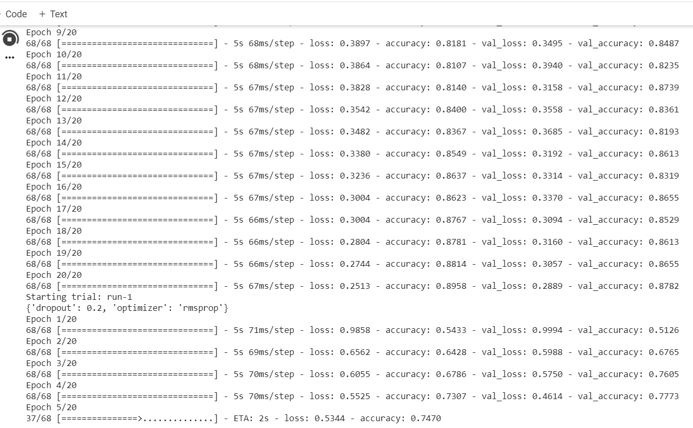
### Parameters visualisation using Tensorboard
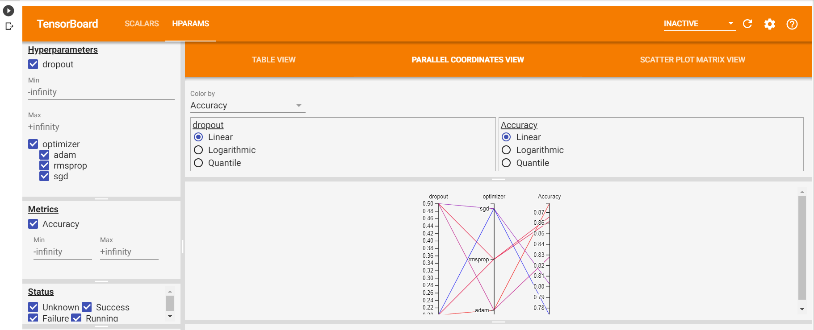
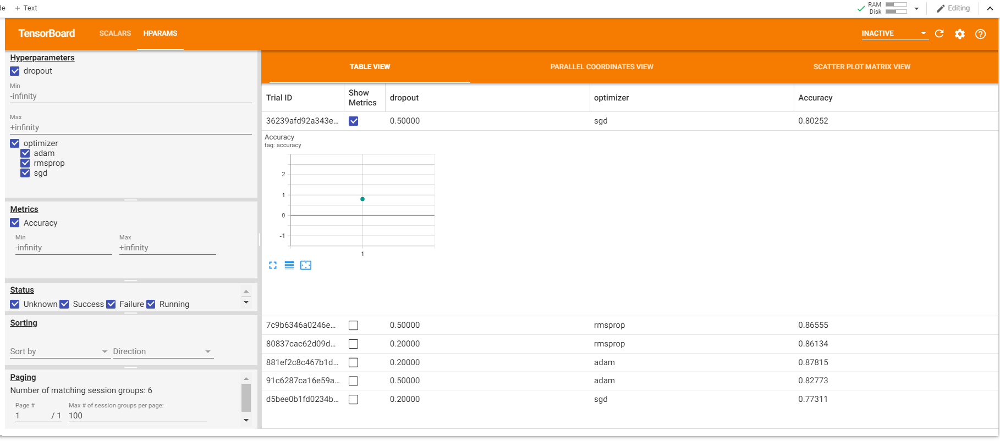
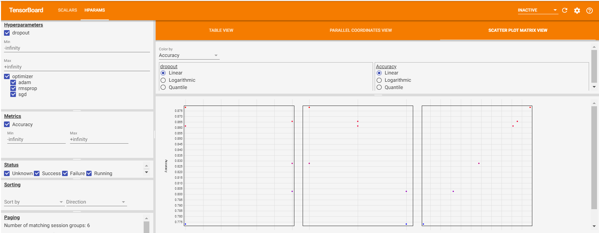
### Accuracy,loss variation graph
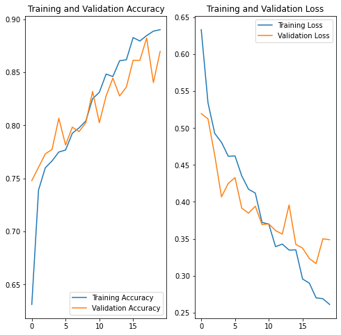
### Predictions Visualisation
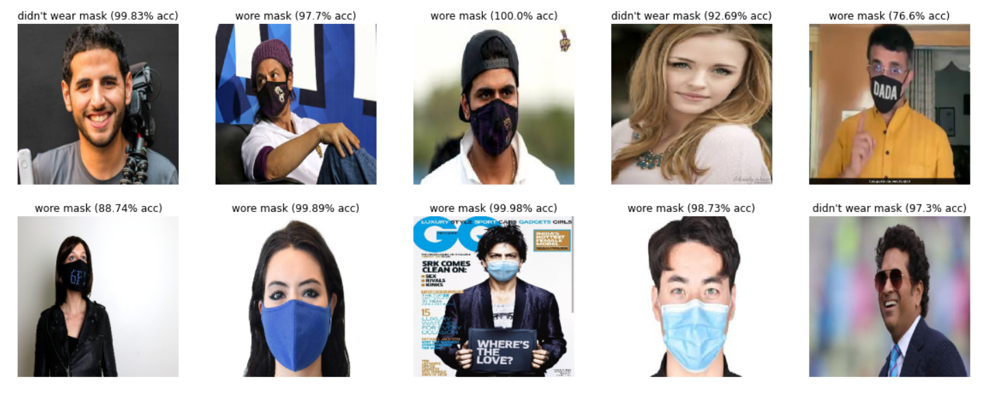
### State of image in various steps of model
#### Train images
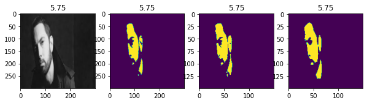
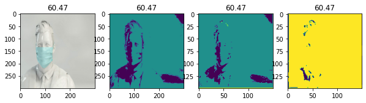
#### Unseen images
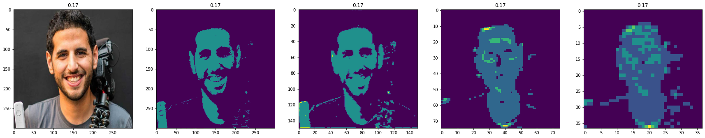
### Image at various filters of given convolution layer
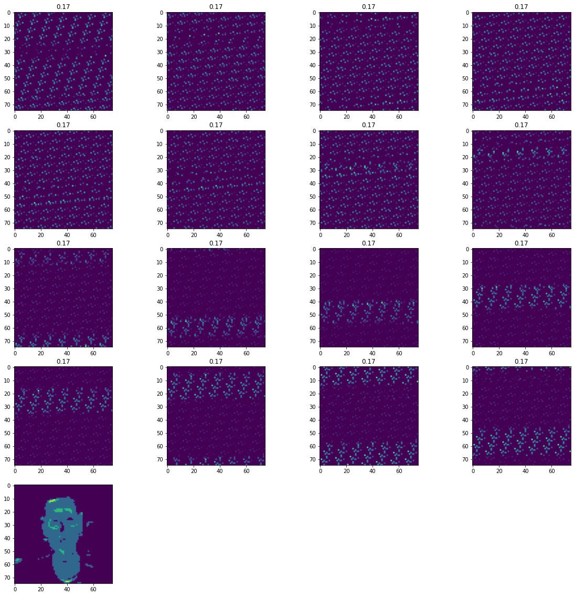
